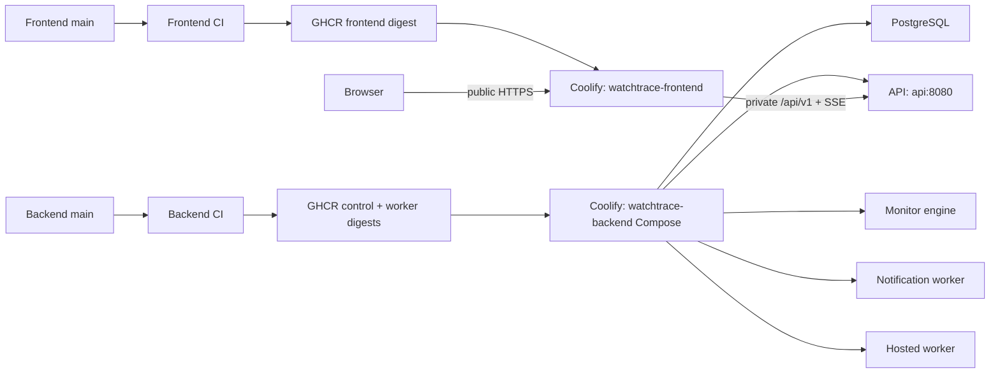

# Phase 1 CI/CD and Production Deployment Runbook

Status: two-resource repository implementation complete; manual cutover pending  
Environment: `prod` only  
Rollback policy: manual rollback through Coolify  
Owner: WatchTrace Engineering  
Last updated: 2026-08-30

WatchTrace currently has one Oracle server, one owner-only environment, no real
clients, and a small personal-project workload. The Phase 1 deployment therefore
uses the smallest design that permits independent frontend delivery:

- one existing backend Docker Compose resource; and
- one standalone frontend Docker Image application.

This is intentionally not a six-resource micro-deployment design. PostgreSQL,
keys, migrations, API, monitor engine, notification worker, and hosted worker
benefit from remaining together in the existing version-controlled Compose
resource. The frontend is split because it has its own repository and should not
restart the backend when only React code changes.

## Decisions and scope

- There is exactly one environment: `prod`.
- Pull requests run CI only and never receive production credentials.
- A successful merge to protected `main` authorizes automatic deployment.
- The approved merge is the Phase 1 production approval; there is no second
  GitHub Environment reviewer by default.
- GitHub builds Linux AMD64/ARM64 images and publishes them to GHCR.
- Production uses immutable registry digests. Nobody manually edits a digest
  after every commit.
- Backend commits deploy the complete backend Compose resource.
- Frontend commits deploy only the standalone frontend application.
- Coolify deployment is not considered successful merely because its API
  accepted a request. GitHub waits for the deployment result, verifies the
  configured digest, and runs public checks.
- Rollback is manual. Application rollback never automatically performs a
  database down migration.
- Scheduled backup/restore remains Phase 4 work while the environment remains
  owner-only and disposable. Persistent volumes are not backups.

## Final production architecture



### `watchtrace-backend`

The existing `deploy/coolify/compose.yml` manages:

- PostgreSQL and its existing named volume;
- deployment-key verification;
- one-shot database migration;
- API;
- monitor engine;
- notification worker;
- hosted worker and its existing journal volume.

It does not contain the frontend after cutover. The service name `api` remains
the private hostname used by frontend Nginx.

### `watchtrace-frontend`

This is a Coolify Docker Image application using
`ghcr.io/watchtrace/watchtrace-console`. It has no database, runtime secret, or
persistent storage. It is the only public application and proxies `/api/v1` and
SSE to `http://api:8080` on the shared predefined network.

## CI behavior

Both repositories retain their existing verification coverage.

### Pull request

```text
pull request → tests and builds → required checks → reviewed merge

No GHCR production publication
No Coolify token
No deployment
```

### Backend push to `main`

```text
verify Go, PostgreSQL, SQS, Compose, and images
  → publish watchtrace-platform and watchtrace-worker
  → retain both immutable digests
  → read previous WATCHTRACE_CONTROL_IMAGE and WATCHTRACE_WORKER_IMAGE
  → update both Compose variables
  → deploy watchtrace-backend once
  → wait for Coolify completion
  → verify both saved immutable references
  → run public HTTPS/frontend/API-proxy checks
  → retain a 90-day JSON release record
```

Compose retains its existing dependency ordering. A backend deployment verifies
the server keyset, starts PostgreSQL, runs migration, and reconciles the backend
processes. Deploying them together is acceptable for the current scale and is
simpler than coordinating several independent control applications.

### Frontend push to `main`

```text
verify React, TypeScript, contract, container, and browser behavior
  → publish watchtrace-console
  → retain the immutable digest
  → update only watchtrace-frontend
  → deploy and wait for Coolify completion
  → verify deployment digest and public route
  → retain a 90-day JSON release record
```

The frontend workflow does not call the backend resource UUID and therefore
cannot restart PostgreSQL, API, monitor, notification, or hosted worker.

### Deployment helpers

Backend `scripts/coolify-deploy.sh`:

- requires an HTTPS Coolify API URL;
- validates the backend resource UUID and both SHA256 digests;
- reads the existing non-secret image variables for rollback history;
- updates both image variables in one bulk API request;
- triggers the Compose resource once;
- polls the returned deployment UUID until success/failure/timeout; and
- verifies Coolify saved both expected immutable image references.

Frontend `scripts/coolify-deploy.sh` updates the Docker Image application's
`docker_registry_image_tag` to Coolify's `sha256-<64-hex>` form, triggers only
that UUID, polls the deployment, and verifies the reported and saved digest.

## GitHub manual configuration

### Actions and branch protection

Perform this in both repositories:

1. Open **Settings > Actions > General** and allow the reviewed GitHub Actions.
   The publish job needs `packages: write`; workflow defaults remain read-only.
2. Protect `main` with required CI checks, resolved conversations, and no force
   pushes/deletion.
3. If more than one maintainer is available, require at least one pull-request
   approval and dismiss stale approvals. If the owner is currently the only
   developer, requiring another approval would make merging impossible; rely on
   required checks until a second maintainer exists.
4. Do not send Actions secrets to fork pull requests.

### GitHub `prod` environment

1. In each repository open **Settings > Environments** and create exactly
   `prod`.
2. Restrict its deployment branch to `main`.
3. Leave **Required reviewers** empty under the agreed single-approval policy.
   Adding a reviewer later creates a second post-merge approval without a code
   change.
4. Add environment secret `COOLIFY_TOKEN`.

A secret is an encrypted value supplied to the job but not committed to Git.
`COOLIFY_TOKEN` is a Coolify machine credential, not a GitHub/GHCR token. Give
it Coolify `read`, `write`, and `deploy`; it does not need root or
`read:sensitive`.

### Repository variables

Add to both repositories:

| Variable | Value/purpose |
| --- | --- |
| `COOLIFY_DEPLOY_ENABLED` | Start as `false`; change to `true` after cutover |
| `COOLIFY_API_URL` | Public HTTPS Coolify origin, with or without `/api/v1` |
| `WATCHTRACE_PUBLIC_URL` | Public HTTPS frontend URL, no trailing slash |

Add only to `watchtrace-platform`:

| Variable | Purpose |
| --- | --- |
| `COOLIFY_BACKEND_UUID` | Existing backend Docker Compose application UUID |

Add only to `watchtrace-console`:

| Variable | Purpose |
| --- | --- |
| `COOLIFY_FRONTEND_UUID` | Standalone frontend Docker Image application UUID |

Delete the old `COOLIFY_DEPLOY_WEBHOOK` secret after the API-based deployment
succeeds. The workflows no longer use a shared webhook.

## Coolify manual configuration

### 1. Project and networking

Use project **WatchTrace**, environment **prod**, and the same Oracle
server/destination for both resources. Enable **Connect To Predefined Network**
on both. A Coolify environment name organizes resources; shared private
communication comes from the destination network.

Do not publish host ports for backend services. Only the frontend receives a
public domain.

### 2. GHCR access

If packages are private, create a dedicated GitHub personal access token
(classic) with only `read:packages`. A personal access token is a revocable
machine password. It allows Oracle to pull packages without storing a human
GitHub password or a package-write credential.

SSH as the operating-system user Coolify uses for Docker:

```sh
printf '%s' "$WATCHTRACE_GHCR_READ_TOKEN" | \
  docker login ghcr.io \
    --username "$WATCHTRACE_GHCR_USER" \
    --password-stdin
unset WATCHTRACE_GHCR_READ_TOKEN
```

Test an immutable control, worker, and frontend reference with `docker pull`.

### 3. Coolify API token

Open **Keys & Tokens > API Tokens** and create `github-actions-prod`:

- permissions: `read`, `write`, `deploy`;
- an expiry date you will remember to rotate;
- no root and no sensitive-value read permission.

`read` inspects image settings and deployment status. `write` changes the image
digest/Compose variables. `deploy` starts the resource. Copy the token into both
GitHub `prod` environment secrets.

### 4. Backend resource

Keep the existing Docker Compose resource and rename it
`watchtrace-backend` if desired. Configure:

- Compose file: `deploy/coolify/compose.yml`
- Connect To Predefined Network: enabled
- Git auto-deploy: disabled
- public domains: none after frontend cutover
- host ports: none
- existing PostgreSQL volume: unchanged
- existing worker-journal volume: unchanged
- existing `/data/watchtrace/keyset` mounts: unchanged

Keep `.env.example` variables, except the frontend image variable has been
removed. Keep `WATCHTRACE_CONTROL_IMAGE` and `WATCHTRACE_WORKER_IMAGE` visible
as ordinary non-secret variables because CI needs their previous values for the
release record. Keep database, AWS, and SMTP credentials secret.

Do not recreate the database or worker volume. This architecture intentionally
avoids any state migration.

### 5. Frontend application

Create **+ New > Docker Image**:

| Setting | Value |
| --- | --- |
| Name | `watchtrace-frontend` |
| Image | `ghcr.io/watchtrace/watchtrace-console` |
| Initial tag/hash | An immutable candidate digest |
| Ports Exposes | `8080` |
| Ports Mappings | Empty |
| Connect To Predefined Network | Enabled |
| Runtime variables | None |
| Persistent storage | None |
| Stop grace period | 30 seconds |
| Consistent Container Names | Disabled |
| Custom container name | Empty |
| Docker Images To Keep | At least 5 |

Health check:

| Setting | Value |
| --- | --- |
| Type/scheme | HTTP |
| Method | GET |
| Host | `127.0.0.1` |
| Port | `8080` |
| Path | `/health` |
| Expected code | `200` |
| Interval | 15 seconds |
| Timeout | 5 seconds |
| Retries | 5 |
| Start period | 10 seconds |

The frontend has no secret and does not need host key mounts. Assign the public
WatchTrace HTTPS domain only to this resource on internal port 8080. If an owned
domain is not ready, the documented temporary hostname
`watchtrace-129-159-236-232.sslip.io` can point to `129.159.236.232`. Keep only
TCP 80 and 443 public.

Coolify can perform a health-gated replacement because the frontend has a
health check, no host port, no consistent/custom name, and no writable volume.
This improves frontend deployment without forcing backend services into the
same operational model.

### 6. Private API connection

The frontend Nginx configuration resolves `api:8080`. After both resources join
the predefined network, verify from the frontend container that:

```text
api resolves through Docker DNS
http://api:8080/health/ready returns success
/api/v1 requests work through the public frontend hostname
SSE is not buffered
```

If `api` does not resolve, inspect the backend Compose network attachment before
changing application code. The Compose service is already named `api`.

## One-time cutover

1. Set `COOLIFY_DEPLOY_ENABLED=false` in both repositories.
2. Record current control, worker, and frontend image references.
3. Take an optional one-time Oracle boot-volume snapshot before the structural
   edit. This is prudent cutover protection, not a nightly backup system.
4. Create `watchtrace-frontend` on the shared predefined network without its
   public domain. Deploy and check `/health` and private API DNS.
5. Update the existing Compose resource from Git. Inspect the diff: it should
   remove only the `frontend` service and retain all backend services and both
   named volumes.
6. Remove the old Compose-managed frontend container. Do not delete any volume.
7. Move the public domain from the old frontend service to
   `watchtrace-frontend` on port 8080.
8. Verify public `/health`, React routes, `/api/v1/auth/me`, sign-in, one hosted
   monitor, notification, SSE recovery, PostgreSQL data, and worker journal.
9. Copy the two resource UUIDs into their GitHub repository variables.
10. Enable deployment and make one intentional frontend commit. Confirm Coolify
    creates only a frontend deployment.
11. Make one intentional backend commit. Confirm Coolify creates only the
    backend Compose deployment.
12. Rehearse frontend rollback and backend rollback before declaring cutover
    complete.

## Routine deployment and rollback

Before merging, ensure a schema or queue change is compatible with the currently
running release. Phase 1 migrations use expand/contract compatibility so the
previous image can still run during the rollback window.

### Frontend rollback

1. Set `COOLIFY_DEPLOY_ENABLED=false` in both repositories.
2. Open `watchtrace-frontend > Deployments` and select the previous deployment,
   or paste the previous digest from the retained GitHub release artifact.
3. Verify `/health`, UI routes, API proxy, authentication, and SSE.

### Backend rollback

1. Disable automatic deployment.
2. Read both previous references from the backend release artifact.
3. Set `WATCHTRACE_CONTROL_IMAGE` and `WATCHTRACE_WORKER_IMAGE` to those exact
   references in the Compose resource.
4. Redeploy the backend resource once.
5. Verify key check, migration result, API, monitor, worker, notification,
   PostgreSQL data, and worker journal.
6. Do not run a database down migration automatically.

## Required implementation and cutover checks

- [x] Remove the frontend from the backend Compose definition without changing
  PostgreSQL or worker-journal volume definitions.
- [x] Preserve and validate the existing backend Compose key checks, migration
  ordering, health checks, and private-port policy.
- [x] Implement backend immutable digest updates, one Compose deployment,
  status polling, saved-value verification, and release record retention.
- [x] Implement frontend-only immutable digest deployment, status polling,
  digest verification, public checks, and release record retention.
- [x] Add automated tests for the backend Compose deployment helper and validate
  both GitHub workflows.
- [x] Update deployment documentation for the two-resource architecture.
- [ ] Create and configure the standalone frontend application in live Coolify.
- [ ] Verify frontend-to-`api:8080` connectivity on the predefined network.
- [ ] Move the public domain and prove a frontend commit deploys only frontend.
- [ ] Prove a backend commit deploys only the backend Compose resource.
- [ ] Rehearse and record frontend and backend rollback on Oracle ARM64.

The live cutover gate is complete only when every checkbox above is checked.

## Sources

### Repository

- [Backend workflow](../.github/workflows/backend-ci.yml)
- [Backend Compose definition](../deploy/coolify/compose.yml)
- [Backend configuration template](../deploy/coolify/.env.example)
- [Coolify operations README](../deploy/coolify/README.md)
- [Backend deployment helper](../scripts/coolify-deploy.sh)
- Frontend workflow: `../../watchtrace-console/.github/workflows/frontend-ci.yml`
- Frontend deployment helper: `../../watchtrace-console/scripts/coolify-deploy.sh`
- Frontend Nginx: `../../watchtrace-console/nginx.conf`

### Platform documentation

- [Coolify Docker Image applications](https://next.coolify.io/docs/applications/deployments/docker-image)
- [Coolify Docker Compose applications](https://next.coolify.io/docs/applications/builds/docker-compose)
- [Coolify rolling updates](https://next.coolify.io/docs/applications/deployments/rolling-updates)
- [Coolify Docker registries](https://next.coolify.io/docs/applications/builds/docker-registries)
- [Coolify API requests](https://next.coolify.io/docs/api/making-requests)
- [Coolify application update API](https://next.coolify.io/docs/api/endpoints/applications/update-application-by-uuid)
- [Coolify bulk environment-variable API](https://next.coolify.io/docs/api/endpoints/applications/update-envs-by-application-uuid)
- [Coolify deployment API](https://next.coolify.io/docs/api/endpoints/deployments/deploy-by-tag-or-uuid)
- [GitHub deployment environments](https://docs.github.com/en/actions/reference/workflows-and-actions/deployments-and-environments)

Update this runbook whenever resource topology, variable ownership, deployment
ordering, persistence, credentials, health gates, or rollback behavior changes.
